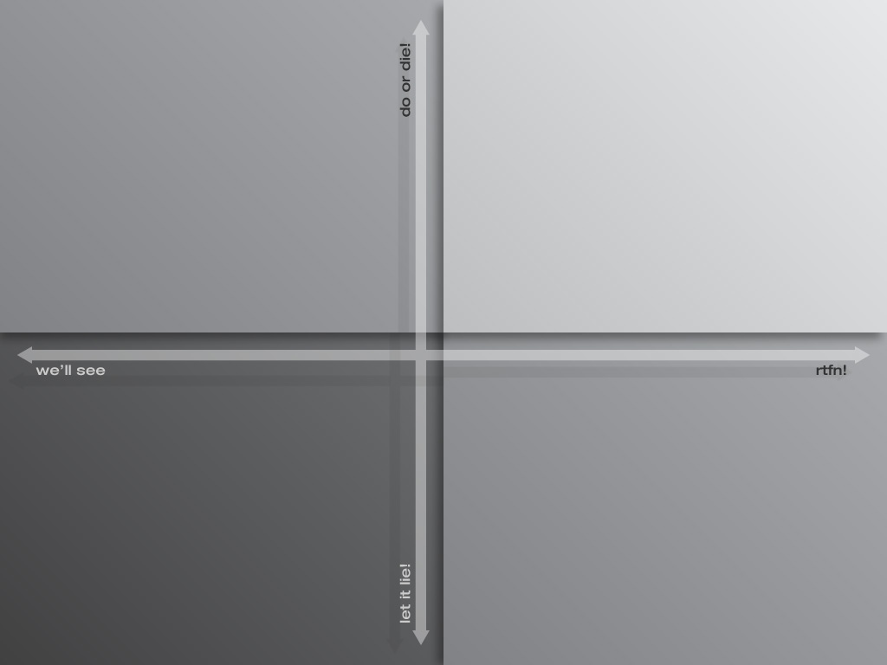
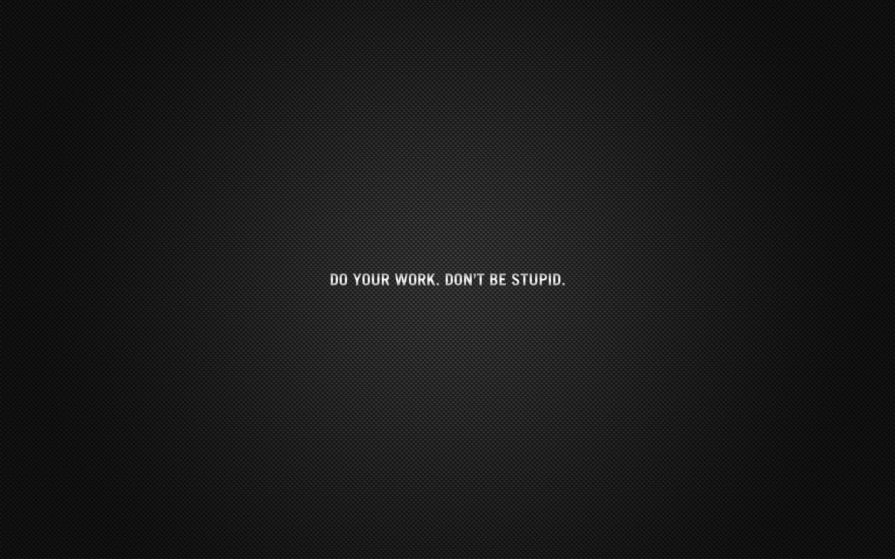

Saw some great wallpapers for getting things done that I liked. Here are some of my favorites:

Both of the ones above were taken from this post: [Wallpaper Roundup: Getting Things Done with Workflows and Quadrants - Wallpaper - Lifehacker](http://lifehacker.com/5337496/)

Although my favorite might still be this one, as it's straight and to the point. Plus it's got a cool background texture. Enjoy.

