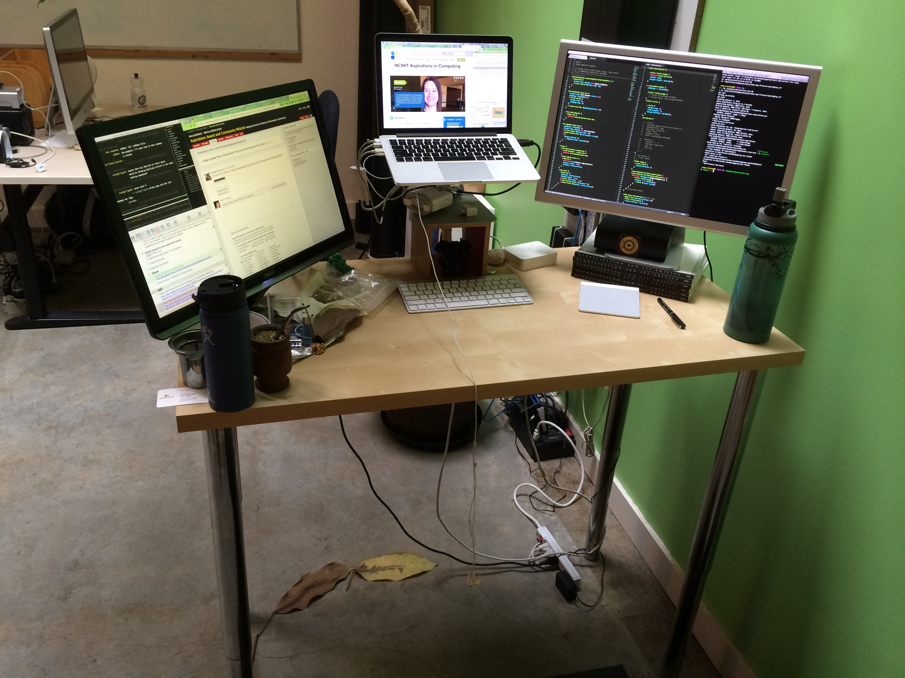

This is a continually updated list of what I'm currently using.

## Workspace

* [Cheap minimal standing desk](http://www.amazon.com/gp/product/B0050S7CK8/ref=as_li_ss_tl?ie=UTF8&camp=1789&creative=390957&creativeASIN=B0050S7CK8&linkCode=as2&tag=evalov-20) from IKEA.
* [Stool](http://www.amazon.com/gp/product/B001FB5KA8/ref=as_li_ss_tl?ie=UTF8&camp=1789&creative=390957&creativeASIN=B001FB5KA8&linkCode=as2&tag=evalov-20) for when standing gets old.
* [Nada Chair](http://loveatfirstsit.com/) for correct lumber alignment while on said stool — better back support than **any** chair I've used.
* West facing window that overlooks a nice scene and allows me to focus far away and not close at my computer all the time. Bonus: sunny afternoons soak me in sun and leave my monitors glare-free. *Love* those days.
* Sunlamp for keeping energy high when said sun is not around.
* Awesome [cat](http://www.flickr.com/photos/footfun/3838719190/) that thinks he's cooler than my keyboard.
* Yerba Maté for caffeine (but I still love coffee). [Here's why I love it.](http://www.evanlovely.com/personal/why-i-love-yerba-mate-and-its-benefits/)

## Hardware

* 13" Retina MacBook Pro - *love* the pixel density: displays as much as a 20" monitor.
* 23" Cinema Display - had this since 2004 and love it.
* A [Laptop Stand](http://amzn.to/ZBE3pA), an Apple Bluetooth Keyboard, & a Magic Trackpad - needed to get the laptop's display up in height so I didn't hunch to look at it. Back pain sucks. Used to be anti-external keyboard as I loved having my thumbs rest on the trackpad & fingers on the keyboard but whatever; the Magic Trackpad is epic and I love how I can position it so my wrist is always straight.
* Time Machine drive that backs up laptop & a portable USB3 hard drive that holds all photos. I have another Time Machine hard drive off site that gets updated with the photos hard drive & laptop about once a week or so. If my house got broken into and all computers & hard drives got stolen, I'd lose no data; I'm mainly concerned about my 60,000 photos I've taken over the past 13 years. 

## Software ##

Oh boy, this could be a lot; however being a Front End Web Developer is my trade and these are my tools. Here we go.

### Using a Mac Without These Apps Just Feels Wrong ###

* [Alfred](http://www.alfredapp.com) - The ultimate productivity utility. I used to be a big [LaunchBar](http://www.obdev.at/products/launchbar/index.html) fan, but have recently crossed over to the Alfred camp. I can already see the benefits. I highly suggest people moving from using Spotlight as an application launcher to using one of these amazing swiss-army utilities. Version 2's workflow are out of this world.
* [Moving the arrow keys to the home row](http://www.evanlovely.com/technology/improving-custom-home-row-arrow-keys-mac-hyper/) - Holy crap what a time saver; just like using keyboard shortcuts saves you time by not moving your hand off the home row, having your arrow keys in a place that doesn't require you to move your hands off the home row saves you **so** much time.
* [TotalFinder](http://totalfinder.binaryage.com/) - Gives Finder tabs, why the hell are they not there now? Tabs are *everywhere*, hell: IE7 has tabs! 
* [Divvy](http://mizage.com/divvy/) - Effortless window management
* [Flux](http://stereopsis.com/flux/) - Save your eyesight at night by tinting your monitor at sunset. Helps you sleep better too; seriously.

### Without These Apps, I'd Be an Organizational Mess ###

* [OmniFocus](http://www.omnigroup.com/products/omnifocus/) - I have a love/hate relationship with this application: I love it because my life would be a mess without knowing what I need to do and I hate it because it reminds me of how much stuff I need to do. I am a self-admitted app junky and I have tried all the to do apps, and this is hands down the best one. Learning it takes a lit bit more work than your average app, but the return is far greater, and OmniFocus 2 for the Mac looks to of improved the usability hurtles that the initial version had. I love the syncing with my iPhone app which is robust and powerful as well. For those that are curious: I had my start with OmniOutliner + Kinkless to handle tasks before OmniFocus.
* [Dropbox](http://db.tt/50dRrVC) - Truly safe storage & syncing of files. We rely on it's multi-user file sharing heavily for our location-distributed web development work at OMBU Web and with other clients, and it provides versioned backups *every time you save a file*. Also, I keep a lot of plain text files in Markdown format for my notes on projects or anything else that is frequently referenced and edited heavily and bounce between [nvAlt](http://brettterpstra.com/projects/nvalt/), [Byword](http://bywordapp.com/), and [MultiMarkdown Composer](http://multimarkdown.com/) for editing, and  for just about everything else it heads to the next item.
* [Evernote](http://evernote.com) - If it makes it into Evernote, I **know** it'll be safe and more importantly: that I can find it within two minutes. I've been using Evernote since April 17, 2008 (got in during private beta) and currently have 3,472 notes; and I can find anything that's in there in about two minutes, even from my phone. And since I can add to it from my phone, it gives me a super important thing: ubiquitous capture and retrieval i.e. I can add to it and get stuff from it and anyplace and anytime (yea, there are a few exceptions, but it's a lot of places!). And that means I trust it! 
* [1Password](https://agilebits.com/onepassword) - There are a few things that don't make it into Evernote or Dropbox: passwords, credit card numbers, and other things that belong in a digital safe. The app is [super secure](http://help.agilebits.com/1Password3/security.html) too. 
* Calendar - I subscribe to GTD's approach to calendaring: it is the immovable landscape. However I have other calendars as well for optional events: Fun for anytime I see a concert flyer or cool thing to do, and I set a two day heads-up alarm so I can act on going with enough time to plan. My favorite way to interact with my calendar is easily [Fantastical](http://flexibits.com/fantastical); I love that it's  always up in my menu bar and putting events into it is not only easy but a joy. That's right: I just said that it can make calendaring a joy, therefore the app must be awesome :)

### Front End Web Development Apps ###

* [Sublime Text](http://www.sublimetext.com/) - The code editor of my dreams and so incredibly powerful. All the "GoTo" functionality makes it feels like the editor is an extension of your brain. I'll be giving a presentation at the Portland Front End Drupal Users Group this week actually! It'll include this app and a few of my favorite packages:
  * [Emmet](http://docs.emmet.io/) - rapid CSS & HTML expansion
  * Git - Commit, push, pull & more quickly from within Sublime Text
  * Sidebar Enhancements - Should really be baked into the core app functionality
* [SourceTree](http://www.sourcetreeapp.com/) - Great visual version control app for Git, Mercurial, and Subversion.
* [Xscope](http://iconfactory.com/software/xscope) - My indispensable digital ruler; I particular love the "Loupe".
* [CodeKit](http://incident57.com/codekit/) - Slick code assistant for all your SASS & LESS CSS processing needs. Web Development feels wrong without live reload as well.
* [Google Chrome Canary](https://www.google.com/intl/en/chrome/browser/canary.html) - It blows me away how much you can do in the Web Inspector now, keep the latest improvements coming your way. [Here's why you should use Chrome Canary over Chrome](http://paulirish.com/2012/chrome-canary-for-developers/).
* [Sketch](http://www.bohemiancoding.com/sketch/) - A true *web* design application. At least as close as we're getting right now...
* Photoshop - Only because I have to. More and more I'm seeing this great application that was made for editing photos (hence the name: *Photo*Shop) and using it to design the movable web. 
* [SequelPro](http://www.sequelpro.com/) - Makes MySQL Database management easy.
* [ScreenFloat](http://www.screenfloatapp.com/) - Floatable screenshots. Great for grabbing just a slice of a comp and pulling it with you. Great for those times that screen real estate is a concern. Bonus: if you scroll down while hovering over them you can make them transparent and use them for pixel perfecting web work. Love this app.
* [Eon](http://www.fuelcollective.com/eon) - Awesome time tracking that integrates with tons of sites. 
* [Dash](http://kapeli.com/) - Quick reference to documentation for tons of stuff, here's what I have: HTML, CSS, Drupal, Wordpress, Bootstrap, LESS, SASS, Compass, jQuery, Javascript, & PHP.
* [ImageOptim](http://imageoptim.com/) & [ImageAlpha](http://pngmini.com/) - Fabulous image compression
* [Pixa](http://www.pixa-app.com/) - Stock Images & Vector organization. This app is so sweet I almost want to write a blog post about just it. Can scan an external folder, uses OpenMeta (native) tags, can search by color… it's just sweet.
* [Skitch](http://evernote.com/skitch/) - Screenshots with arrows and text just explains things *so* much better. They've also fixed a lot of things that people didn't like about the 2.0 update.
* [Patterns](http://krillapps.com/patterns/) - **Finally** allowed me to understand Regular Expressions.
* [TextExpander](http://smilesoftware.com/TextExpander/index.html) - Code Snippet & frequently used text management. I used to use and love [CodeBox], but it seems to of dropped off in active development and I'm seeing more features I like with TextExpander.

### Photo Management ###

* [Aperture](http://www.apple.com/aperture/) - iPhoto Pro basically.
* [PanoEdit](http://www.panoedit.com/) - Panorama merging. Used to use Photoshop's Auto-Align & Auto-Blend.
* [PlaceTagger](http://www.placetaggerapp.com/) - Geotag your SLR photos by having your iPhone track your GPS route.

### Helpful Utilities

* [Yoink](http://www.eternalstorms.at/yoink/Yoink_-_Draggings_a_drag_no_more/Yoink_-_Draggings_a_drag_no_more%21.html) - Finder drag 'n drop zone (the best part of PathFinder)
* [Droplr](https://droplr.com/hello) - Super helpful for sending files across the web without email. Gives you a nice little share link. Tip: Append '+' to them to get a direct link (helpful for embeds!).
* [Mint.com Menu Bar Helper](https://itunes.apple.com/us/app/mint-quickview/id533491939?mt=12) - Quick view into your financial overview.
* [Hazel](http://www.noodlesoft.com/hazel.php) - Powerful automated organization. I'm just starting to get into this, already see the benefit, and am sure I'll blog about some really cool uses soon!

### Miscellaneous

* [Reeder](http://reederapp.com/mac/) - Excellent RSS Reader that syncs with Google Reader.
* [TweetBoot](http://tapbots.com/software/tweetbot/mac/) - Phenomenal Twitter App

